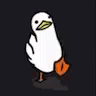

  

<h1 align="center">gui.bertoso</h1>

  real-time systems & procedural generation

  systems • performance • scalability

  <a href="https://gui-bertoso.github.io/portfolio/">My portfolio website</a>

---

  <b>──────── PROJECTS ────────</b>

<b>procedural-survival-game (main)</b> 
real-time world systems • procedural generation • performance optimization  

<b>project-horizons</b> 
systems-driven experiments and reusable architectures  

<b>project-horizons-csharp</b> 
performance-focused systems and code architecture  

<b>call-of-mages</b> 
gameplay systems and rapid prototyping

---

  <b>──────── STACK ────────</b>

godot • c# • python • c++ 
systems • performance • automation • machine learning

---

  <b>──────── CONTACT ────────</b>

discord: <b>pato_lizo</b>

