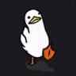

  

<h1 align="center">gui.bertoso</h1>

  <b>PROJECTS</b>

<b>maya (main)</b> 
a machine learn adaptative virtual assistant  

<b>machine learn experiments</b> 
tests with machine learn  

<b>balls physics</b> 
tests with physics in a simulated ambient  

---

  <b>STACK</b>

godot • c# • python • c++ 
systems • performance • automation • machine learning

---

  <b>CONTACT</b>

discord: <b>pato_lizo</b>
instagram: <b>gui.bertoso</b>

